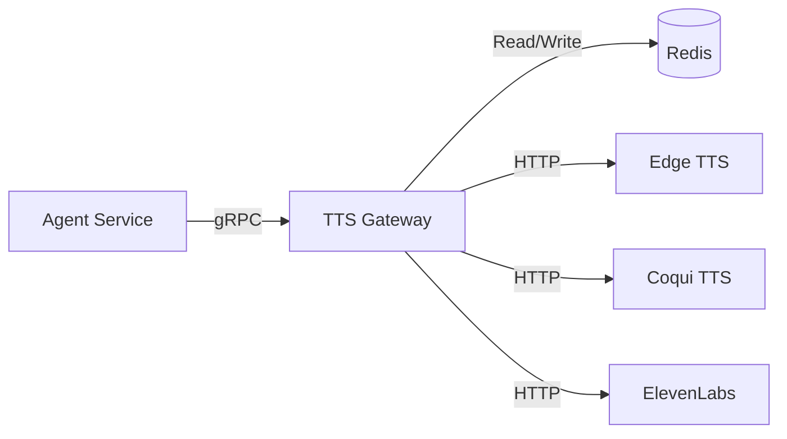

# 🧠 Mantık ve Akış Mimarisi

**Stratejik Rol:** Platformun ses üretimindeki "Trafik Polisi".

## 1. Yönlendirme Algoritması

Gelen bir `SynthesizeRequest` şu mantıkla işlenir:

1.  **Hash Kontrolü:** İstek parametrelerinin (text, speaker, speed, pitch) MD5 hash'i alınır.
2.  **Cache Lookup:** Redis'te bu hash anahtarı aranır.
    *   **HIT:** Önbellekteki ses verisi (WAV/MP3) doğrudan döndürülür. Motorlara gidilmez.
    *   **MISS:** Adım 3'e geçilir.
3.  **Motor Seçimi:**
    *   Eğer `speaker_wav` (klonlama dosyası) varsa -> **Coqui TTS**.
    *   Eğer `voice_selector` "elevenlabs" içeriyorsa -> **ElevenLabs**.
    *   Aksi halde (Varsayılan) -> **Edge TTS** (Hızlı ve Ücretsiz).
4.  **Proxy İşlemi:** Seçilen motorun HTTP API'sine istek atılır.
5.  **Cache Write:** Dönen ses verisi Redis'e yazılır (TTL: 24 saat).
6.  **Yanıt:** Ses verisi istemciye gRPC yanıtı olarak dönülür.

## 2. Mimari Şema

