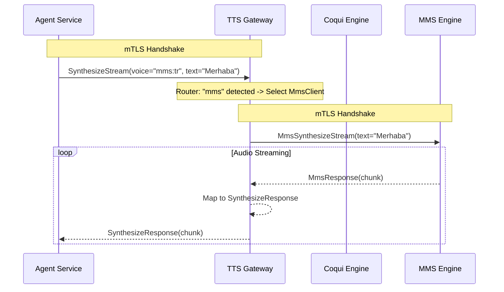

# 🧠 Mantık ve Yönlendirme Mimarisi (v2.0)

Bu belge, `tts-gateway-service`in bir isteği nasıl işlediğini ve hangi motora yönlendireceğine nasıl karar verdiğini açıklar.

## 1. Yönlendirme Algoritması (Routing Logic)

Gateway, gelen `SynthesizeStreamRequest` içindeki `voice_id` alanını analiz eder.

| Ön Ek (Prefix) | Hedef Servis | Protokol | Örnek `voice_id` |
| :--- | :--- | :--- | :--- |
| `coqui:` | **Coqui TTS** | gRPC Stream | `coqui:F_TR_Genc_Selin/happy` |
| `mms:` | **MMS TTS** | gRPC Stream | `mms:tr` |
| *(Diğer)* | **Coqui TTS** | gRPC Stream | *(Varsayılan Fallback)* |

## 2. Veri Akış Diyagramı

## 3. Güvenlik Mimarisi (mTLS)

Bu servis **Zero Trust** prensibiyle çalışır:
1.  **Server Modu:** Kendisine bağlanan `Agent/Telephony Service`'in güvenilir olduğunu doğrulamak için CA sertifikasını kullanır.
2.  **Client Modu:** `Coqui` veya `MMS` servisine bağlanırken kendi kimliğini (Client Certificate) ibraz eder.

Sertifika yolları `config.rs` üzerinden yüklenir ve `src/tls.rs` modülünde işlenir.