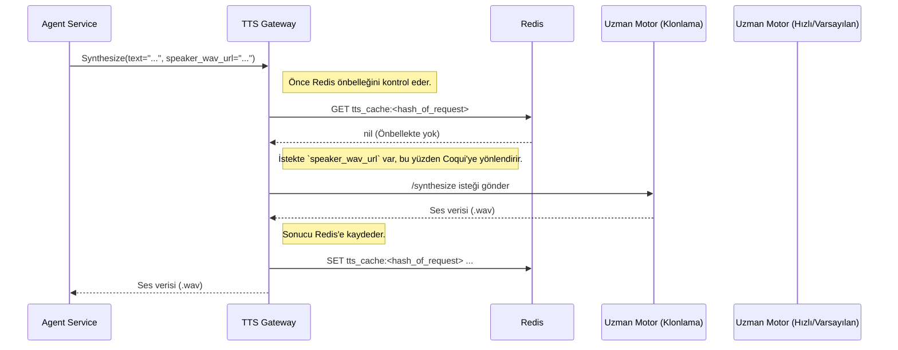

# ⚡ Sentiric TTS Gateway Service - Mantık ve Akış Mimarisi

**Belge Amacı:** Bu doküman, `tts-gateway-service`'in platformun **"akıllı ses üretim santrali"** olarak rolünü, istekleri nasıl işlediğini ve uzman TTS motorlarını nasıl yönettiğini açıklar.

---

## 1. Stratejik Rol: "Akıllı TTS Yönlendiricisi"

Bu servis, platformu tek bir TTS teknolojisine bağımlı kalmaktan kurtarır. `agent-service`'in sadece "bu metni sese çevir" demesi yeterlidir. Hangi motorun kullanılacağı, sonucun önbelleğe alınıp alınmayacağı gibi karmaşık kararları bu servis verir.

**Bu servis sayesinde platform:**
1.  **Maliyet-Etkin Olur:** Sık kullanılan anonsları Redis'te önbelleğe alarak pahalı AI API çağrılarını önler. Hızlı ve ücretsiz olan `edge-tts`'i varsayılan olarak kullanarak maliyetleri düşürür.
2.  **Yüksek Kaliteli Olur:** Ses klonlama gibi özel yetenekler gerektiren istekleri, bu işi en iyi yapan `coqui-tts` gibi uzman motorlara yönlendirir.
3.  **Dayanıklı Olur:** Bir uzman motor (örn: `coqui-tts`) çökerse, istek otomatik olarak çalışan bir sonraki motora (`edge-tts`) yönlendirilebilir (fallback).

---

## 2. Uçtan Uca Sentezleme Akışı

`agent-service`'ten gelen bir `Synthesize` isteğinin izlediği yol:

