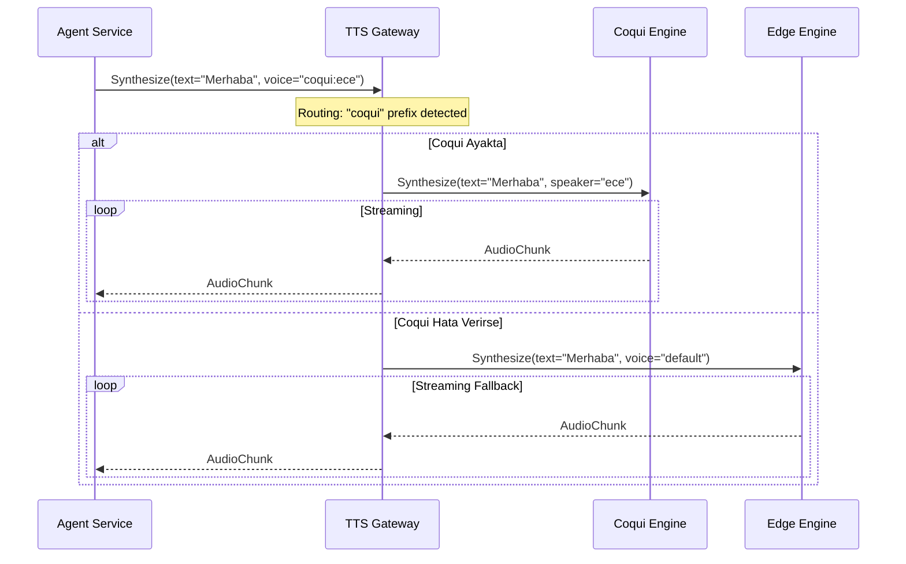

# 🧠 Mantık ve Yönlendirme Mimarisi

Bu belge, `tts-gateway-service`in bir isteği nasıl işlediğini ve hangi motora yönlendireceğine nasıl karar verdiğini açıklar.

## 1. Yönlendirme Algoritması (Routing Logic)

Servis, gelen `SynthesizeRequest` içindeki `voice_selector` alanını analiz eder.

| Ön Ek (Prefix) | Hedef Servis | URL (Env Değişkeni) | Örnek `voice_selector` |
| :--- | :--- | :--- | :--- |
| `coqui:` | **Coqui TTS** | `TTS_COQUI_SERVICE_URL` | `coqui:tr_female_selin` |
| `edge:` | **Edge TTS** | `TTS_EDGE_SERVICE_URL` | `edge:tr-TR-NeslihanNeural` |
| `eleven:` | **ElevenLabs** | `TTS_ELEVENLABS_SERVICE_URL` | `eleven:21m00Tcm4TlvDq8ikWAM` |
| *(Boş/Yok)* | **Edge TTS** | `TTS_EDGE_SERVICE_URL` | *(Varsayılan Fallback)* |

### Algoritma Akışı:

1.  **İstek Al:** `Synthesize(text, voice_selector, ...)`
2.  **Önbellek Kontrolü:** `Redis` üzerinde bu metin+ses kombinasyonu için önbellek var mı?
    *   *Varsa:* Önbellekten dön.
    *   *Yoksa:* Devam et.
3.  **Motor Seçimi:** `voice_selector` parse edilir.
4.  **Bağlantı:** Seçilen motorun gRPC veya HTTP Streaming endpoint'ine bağlanılır.
5.  **Stream:** Gelen `AudioChunk`'lar, anında istemciye `SynthesizeResponse` stream'i olarak iletilir.
6.  **Hata Yönetimi:**
    *   Seçilen motor `UNAVAILABLE` dönerse -> **LOGLA** ve **Edge TTS (Fallback)** servisine yönlendir.

## 2. Akış Diyagramı

